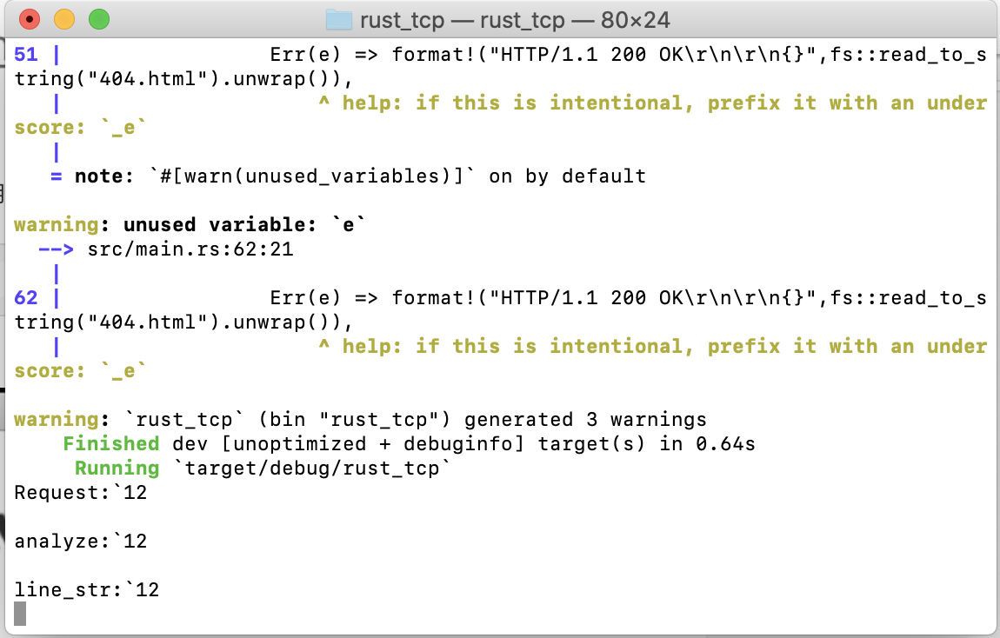
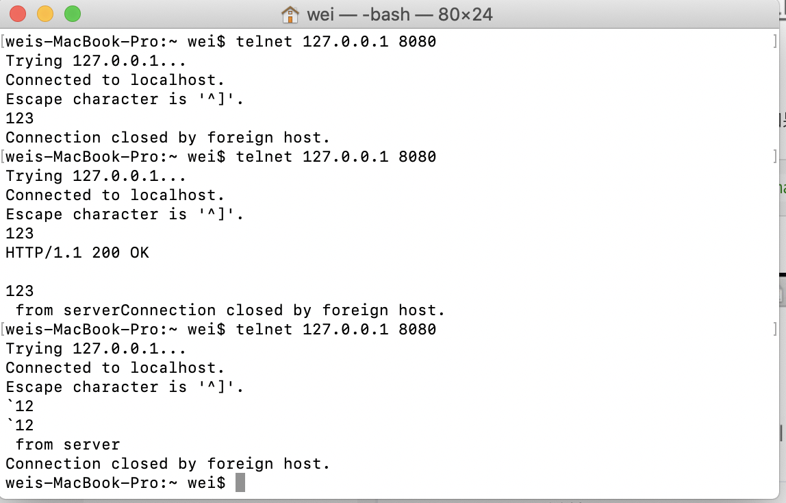

# rust_tcp
A simple tcp server that written in rustlang

# How to build
In the root dir 
```
cargo run
```
Then you can do a test by using telnet as a client

```
telnet 127.0.0.1 8080
```
Also support Web Browser
```
http://127.0.0.1:8080/
```

# ScreenShot
Server
-----------


Client
-----------
